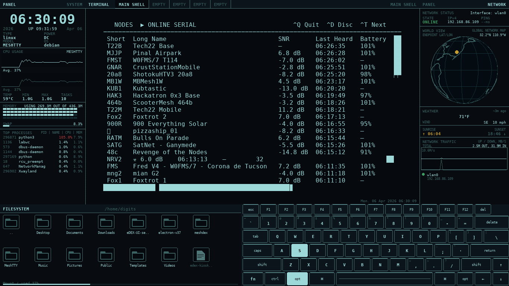

# MeshDEX

> **PRE-RELEASE — v0.1.0 beta.**  
> Core functionality is working. Tested on Raspberry Pi Zero 2 W with a 1366×768 HDMI display running Raspberry Pi OS (Debian Trixie).

MeshDEX is a lightweight, fullscreen terminal UI framework for the Raspberry Pi, designed as a display layer for [MeshTTY](https://github.com/kendelmccarley/MeshTTY) — a terminal TUI client for [Meshtastic](https://meshtastic.org/) LoRa mesh radio networks.

Inspired by [eDEX-UI](https://github.com/GitSquared/edex-ui), MeshDEX delivers the same sci-fi terminal aesthetic at a fraction of the resource cost. Instead of Electron + Node.js (~400MB RAM), it runs on **pure Python + pygame/SDL2** (~30MB RAM).



---

## Layout

```
┌──────────────┬──────────────────────────────────────────────┬──────────────┐
│ PANEL SYSTEM │ TERMINAL    [TAB1] [TAB2] [TAB3] [TAB4] ...  │ PANEL NETWRK │
│              │                                               │              │
│  19:43:31    │                                               │ Network      │
│              │                                               │ Status       │
│  CPU graphs  │         80×24 PTY terminal                    │              │
│  Memory dots │         (MeshTTY or bash)                     │  Globe       │
│  Processes   │                                               │              │
│              │                                               │  Weather     │
│              │                                               │  Sunrise/set │
│              │                                               │  Net traffic │
├──────────────┴──────────────────────────┐                    │              │
│ FILESYSTEM        /home/digits          │                    │              │
│ [folder] [folder] [file] ...            │                    │              │
└─────────────────────────────────────────┴────────────────────┴──────────────┘
                    [ A P P L E   K E Y B O A R D   V I S U A L I Z E R     ]
```

**Left panel:** Large clock, date/uptime, system info grid, dual CPU waveforms, temperature/frequency/task count, memory dot grid, swap bar, top processes list

**Center:** Five independent 80×24 PTY terminals with full VT100/xterm emulation powered by [pyte](https://github.com/selectel/pyte). Switch between tabs with Alt+T or by clicking tab labels. Tab 0 auto-launches MeshTTY if installed.

**Right panel:** Network status and IP, rotating wireframe globe, current temperature, wind speed and direction, sunrise/sunset times (via Open-Meteo), network traffic oscilloscope, interface list

**Bottom left:** Filesystem browser with folder/file icons, current path, disk usage bar

**Bottom right:** Apple keyboard visualizer (laptop layout) with per-key highlight on keypress

---

## Hardware

| Component | Requirement |
|-----------|-------------|
| Board | Raspberry Pi Zero 2 W (or any Pi) |
| Display | HDMI monitor — tested at 1366×768 |
| OS | Raspberry Pi OS Lite or Desktop (Debian Trixie/Bookworm) |
| Python | 3.11+ |
| RAM | ~30MB at runtime |

---

## Dependencies

| Package | Source | Purpose |
|---------|--------|---------|
| `python3-pygame` | apt | Display, input, SDL2 rendering |
| `python3-psutil` | apt | System stats (CPU, RAM, disk, net) |
| `fonts-dejavu` | apt | UI and terminal font |
| `pyte` | pip | VT100/xterm terminal emulator backend |

---

## Installation

```bash
git clone https://github.com/kendelmccarley/MeshDEX.git
cd MeshDEX
bash install.sh
```

The installer handles apt packages, pyte, swap, bash config, and optional kiosk autostart.

### Manual install

```bash
sudo apt install -y python3-pygame python3-psutil fonts-dejavu
pip3 install pyte --break-system-packages
chmod +x meshdex.py launch.sh
```

---

## Running

```bash
./launch.sh
```

Or directly from SSH:

```bash
DISPLAY=:0 python3 meshdex.py
```

### MeshTTY auto-launch

If `~/MeshTTY/launch-pi.sh` exists, MeshDEX automatically runs it in terminal tab 0 (labeled MESHTTY) 1.5 seconds after startup.

```bash
git clone https://github.com/kendelmccarley/MeshTTY.git ~/MeshTTY
cd ~/MeshTTY && bash install-pi.sh
```

---

## Keyboard Reference

MeshDEX is designed to be fully operable without a mouse. All navigation is available via keyboard.

### MeshDEX System Keys

| Key | Action |
|-----|--------|
| `Alt+Q` | Quit MeshDEX |
| `Alt+T` | Cycle to next terminal tab (wraps around) |
| `Alt+S` | Save screenshot to `~/meshdex_screenshot_YYYYMMDD_HHMMSS.png` |

### Terminal Navigation (no mouse required)

| Key | Action |
|-----|--------|
| `Alt+T` | Switch to next tab |
| Mouse click on tab | Switch to that terminal tab |
| All other keys | Passed through to the active terminal |

### Keys Passed Through to Terminal App

All keystrokes are forwarded unmodified to whatever is running in the active terminal tab. This includes:

| Key | Forwarded As |
|-----|-------------|
| `Tab` | Focus cycle forward (MeshTTY) |
| `Shift+Tab` | Focus cycle backward (MeshTTY) |
| `Ctrl+T` | Next tab in MeshTTY |
| `Ctrl+Q` | Quit MeshTTY |
| `Ctrl+R` | Refresh node table (MeshTTY) |
| `Ctrl+D` | Disconnect (MeshTTY) |
| `F1` | Help (MeshTTY) |
| `Enter` | Send message / connect |
| `Escape` | Close modal |
| `↑ ↓ ← →` | Navigation / scroll |
| `Page Up/Down` | Scroll message history |
| `Home / End` | Line start/end |
| `Ctrl+A` | Line start (bash) |
| `Ctrl+E` | Line end (bash) |
| `Ctrl+C` | Interrupt |
| `Ctrl+L` | Clear screen |
| `Ctrl+Z` | Suspend |

### MeshTTY-specific Navigation (inside tab 0)

MeshTTY uses the Textual framework. Navigate it entirely with the keyboard:

| Key | Action |
|-----|--------|
| `Tab` | Cycle focus: message history → channel selector → message input |
| `Shift+Tab` | Reverse focus cycle |
| `Ctrl+T` | Switch between Messages / Channels / Nodes / Settings tabs |
| `↑ / ↓` | Scroll messages or cycle channel/DM selector |
| `Page Up/Down` | Scroll message history one screen |
| `Enter` | Send message or connect |
| `Escape` or `Q` | Close node detail modal |
| `Ctrl+R` | Refresh node table |
| `Ctrl+D` | Disconnect → connection screen |
| `Ctrl+Q` | Quit MeshTTY (returns terminal to bash) |
| `F1` | Help overlay |

---

## Hardcoded Configuration

The following values are hardcoded in `meshdex.py` and must be edited directly if you need to change them.

### Location (Weather & Globe)

Edit the `Stats` class near the top of `meshdex.py`:

```python
class Stats:
    LAT = 32.2        # Latitude  (Tucson, AZ)
    LON = -110.9      # Longitude (Tucson, AZ)
    TZ  = 'America/Phoenix'   # Timezone for sunrise/sunset
```

The globe dot, weather temperature, wind, and sunrise/sunset times all use these coordinates. Change to your location before deploying.

### Screen Resolution

MeshDEX auto-detects the display resolution at startup using `pygame.display.Info()` and scales the layout proportionally. No hardcoded resolution — it adapts to whatever display is connected.

However, the **terminal font size is hardcoded** for 1366×768:

```python
term_font_size = 16   # verified for 1366x768, 90% pane scaling
```

If you use a different resolution, adjust this value so 80 columns fit the terminal pane. Run MeshDEX once and check the printed geometry output:

```
Terminal geometry: font=16pt cw=10 ch=19
  pane=893x523 content=800x456
  offset=(46,33) right_margin=47
```

Increase `term_font_size` until `right_margin` is small but positive.

### Layout Proportions

Defined as fractions of screen width/height — auto-scales to any resolution:

```python
LEFT_W  = int(W * 0.168)   # Left panel width
RIGHT_W = int(W * 0.176)   # Right panel width
FS_H    = int(H * 0.286)   # Filesystem/keyboard strip height
KB_W    = int(W * 0.527)   # Keyboard visualizer width
```

### Terminal Size

Fixed at 80 columns × 24 rows to match MeshTTY's expected dimensions:

```python
TERM_COLS = 80
TERM_ROWS = 24
```

### Number of Terminal Tabs

```python
NUM_TABS = 5   # number of independent PTY sessions
```

Increase for more tabs. Each tab runs a full bash session and consumes roughly 2–3MB of RAM for its pyte screen buffer.

### Framerate

```python
FPS = 12   # target framerate — 12 is smooth on Pi Zero 2 W
```

Increase for smoother animation on faster hardware. Decrease to reduce CPU usage.

### MeshTTY Auto-launch Path

```python
meshtty_launch = os.path.expanduser('~/MeshTTY/launch-pi.sh')
```

Change this path if your MeshTTY installation is elsewhere.

### Weather Fetch Interval

```python
time.sleep(600)   # fetch weather every 10 minutes
```

---

## Terminal Tabs

MeshDEX runs five independent terminal sessions simultaneously. All five are active in the background even when not visible — background processes continue running in inactive tabs.

| Tab | Default name | Contents |
|-----|-------------|---------|
| 0 | MESHTTY (or MAIN SHELL) | MeshTTY auto-launched if installed, otherwise bash |
| 1–4 | EMPTY | bash — available for monitoring, SSH, etc. |

Switch tabs with **Alt+T** (cycles forward) or by clicking the tab label in the header bar.

---

## Screenshots

Press **Alt+S** to capture a screenshot from within MeshDEX. Files are saved to:

```
~/meshdex_screenshot_YYYYMMDD_HHMMSS.png
```

Retrieve via SSH:

```bash
scp digits@<pi-hostname>:~/meshdex_screenshot_*.png ~/Desktop/
```

> Note: External screenshot tools like `scrot` will capture a black screen because SDL2 renders directly to the display hardware. Use Alt+S instead.

---

## Kiosk / Auto-start

### 1. Disable the taskbar

```bash
mkdir -p ~/.config/labwc
cat > ~/.config/labwc/autostart << 'AUTOEOF'
/usr/bin/lwrespawn /usr/bin/pcmanfm-pi &
/usr/bin/kanshi &
/usr/bin/lxsession-xdg-autostart
AUTOEOF
```

### 2. Add MeshDEX to autostart

```bash
echo "sleep 2 && /home/digits/MeshDEX/launch.sh &" >> ~/.config/labwc/autostart
```

### 3. Disable bracketed paste

```bash
echo 'bind "set enable-bracketed-paste off"' >> ~/.bashrc
```

The `install.sh` script handles all of the above automatically when you answer Y to the kiosk prompt.

---

## Performance

- **RAM:** ~30MB (vs ~400MB for Electron-based eDEX-UI)
- **CPU:** 15–30% on Pi Zero 2 W at 12 FPS
- **GPU:** SDL2 software blitting only — no GPU acceleration needed
- **Stats polling:** background thread, every 3 seconds
- **Weather:** background thread, every 10 minutes (Open-Meteo, no API key)
- **Swap:** 2GB swapfile recommended on Pi Zero 2 W

---

## Known Issues

- **Fork deprecation warning** — Python 3.13 warns about `os.fork()` in multithreaded processes. Harmless — the PTY works correctly.
- **Terminal font sizing** — Font size 16 is hardcoded for 1366×768. Other resolutions may need adjustment.
- **Globe** — Simplified polyline coastlines, not GIS-accurate.
- **Wide Unicode characters** — Box-drawing and some Unicode characters may render slightly wider than the cell width.
- **5 PTY processes** — Each tab forks a bash process at startup. On Pi Zero 2 W this is fine but adds ~2s to startup time.

---

## Architecture

```
meshdex.py
├── Stats      — psutil polling thread (3s) + Open-Meteo weather thread (10min)
├── Terminal   — PTY fork + pyte VT100 screen buffer (×5, one per tab)
├── FS         — Filesystem browser (os.scandir)
├── Globe      — Rotating wireframe Earth (pygame draw primitives)
├── Keyboard   — Apple laptop layout renderer + press highlight
└── main()     — pygame event loop + SDL2 rendering at 12 FPS
```

---

## License

MIT — see [LICENSE](LICENSE).

---

## Related

- [MeshTTY](https://github.com/kendelmccarley/MeshTTY) — Meshtastic TUI client (runs inside MeshDEX)
- [Meshtastic](https://meshtastic.org/) — LoRa mesh radio firmware
- [eDEX-UI](https://github.com/GitSquared/edex-ui) — Original inspiration (Electron, desktop hardware required)
- [pyte](https://github.com/selectel/pyte) — Python VT100 terminal emulator
- [Open-Meteo](https://open-meteo.com/) — Free weather API (no key required)
